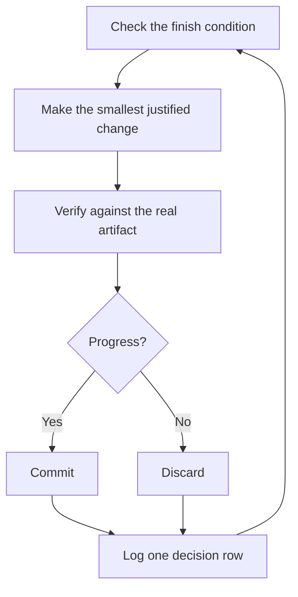

# Keep an active run reviewable

An agent you can trust to verify its own work can keep going on a hard task while its active local session remains supervised. What makes that reviewable is a checkable finish condition, serialized repository writes, and a decision log you audit later.

## Earn the trust before a long run

A loop you don't trust just produces unchecked work faster, and the mess compounds with every iteration. Before you leave one running, check that it has earned it:

- You've done the task once by hand, or watched an agent do it, so you know what good looks like.
- The agent has the tools and signals you'd use yourself: the verification skill, the profiler, the logs.
- Every stage proves its work and can stop the line when the work misses the bar.
- You've read a few transcripts and turned the repeated failures into tools, skills, or checks.

Keep the run in an active local session even after all four hold.

## The active-session contract

A good handoff has the goal, the finish condition, permissions, and an escape hatch. It doesn't need to be long:

```text
/dstack-mode im going to bed. migrate every caller to the new parser in the active checkout.
done means zero old callers, all parser fixtures pass, old api deleted.
keep a decision log. don't ask me before committing.
keep going while this session can supervise the work. if truly stuck, stop and write up why.
```

Walk through what each line buys you:

- "im going to bed" is a session override. The agent stops asking and keeps going.
- "done means..." turns the goal into checks every iteration can run.
- "active checkout" keeps repository writes under the one serialized writer.
- "don't ask me before committing" pre-answers the permission the agent would otherwise block on.
- The active session supervises each iteration. There is no promised wake mechanism after it ends.
- The escape hatch lets it stop at a genuine dead end and write up why, which beats eight hours of creative goal reinterpretation.

Because you'll review this work after stepping away, `/dstack-mode` routes it through [`/figure-it-out`](../../../figure-it-out/SKILL.md), which designs the run's phases before any code and wires in the decision log.

To stop a run on purpose, tell the agent to pause, or that you're about to go offline or restart the host. The [Pause safely playbook](../../../dstack-mode/playbooks/pause-safely.md) finishes or backs out of the current step, commits a work-in-progress checkpoint, and writes a resume note. A fresh chat picks the work up from that note through the Session pickup playbook. Saying "keep going" never triggers a pause.

## What each iteration does



One change, one check, one log row, every iteration. Changes that didn't help get discarded, not left to ride. A plateau means pivot, not stop, and the finish condition never quietly relaxes to declare victory.

## Audit the run

[`/show-me-your-work`](../../../show-me-your-work/SKILL.md) is what makes the run reviewable. Each row records the time, phase, decision, reason, an evidence pointer, and the result, in a TSV at `decisions.tsv` (or `.audit/<task-slug>.tsv` when several runs share a directory). It stays local by default. Commit it when the work is ambitious enough that a reviewer needs the trail to trust the result.

When you're back, ask for the run in review form:

```text
/show-me-your-work catch me up on what you did during this run
```

Before the skill hands back its summary, it spawns a reviewer on a different model family to read the trail and the transcript, and the reply ends with an Attention section listing what deserves your scrutiny. Read that section first, then the log rows it points at. You're auditing decisions, not re-reading the whole run.

## Keep the session boundary explicit

The active local session must remain able to supervise the work. Dstack does not promise scheduled wake, background persistence, or continuation after the session ends. It excludes autonomous runs, autopilot queues, cloud coordinators, and the upstream automation pack.

If the session ends, use Pause safely and Session pickup rather than assuming work continues. For phases or dependent requests, write a multi-phase plan and execute the steps in supervised sessions.

**Pitfall:** a duration is not a finish condition. "work on this for 4 hours" gives the agent nothing to check. Give a predicate that can pass or fail.

Next: [Steer with principle names](./08-principles.md).
